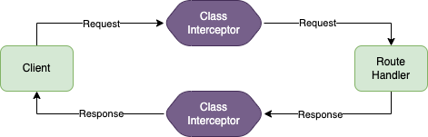

# Interceptors

An interceptor is a provider class decorated with the `@Interceptor()` decorator.
The class, though, must implement the `InterceptorHandler` interface.

The interceptor will provide capabilities of adding extra logic before and after the actual route handler, and also to trap it errors. 



```typescript
@Interceptor()
export class TestControllerInterceptor implements InterceptorHandler {
  after<TResult>(
    context: Context,
    handlerResult: TResult,
  ): HandlerAfterOptions<TResult> | Promise<HandlerAfterOptions<TResult>> | void | Promise<void> {
    console.log('TestControllerInterceptor after', context.response.locals.interceptorTest);
  }

  before(context: Context): HandlerBeforeOptions | Promise<HandlerBeforeOptions> | void | Promise<void> {
    console.log('TestControllerInterceptor before');
    context.response.locals.interceptorTest = { test: 'hello' };
  }

  error<TError>(context: Context, error: HttpException<TError>) {
    console.log('TestControllerInterceptor error');
  }
}
```

Interceptors than can be utilized at **controller** or **route** level via decorating them with the `@Intercept()` decorator.

```typescript
@Intercept(TestControllerInterceptor)
@Controller('/test')
export class TestController {
  constructor(
    private readonly httpService: HttpService,
    private readonly externalService: ExternalTestService,
    private readonly loggerService: LoggerService,
  ) {}
  
  @Get('/hello-world')
  async helloWorld(@Cookie('hayu-portability') portability: string, @Session() session: any) {
    this.loggerService.log({ level: 'info', data: 'Test log from /hello-world' });
    return { test: 'hello world', portability, session };
  }
  
  @Intercept(TestRouteInterceptor)
  @Get('/external')
  async external() {
    return { external: await this.externalService.getExternalCall() };
  }

  @Intercept(TestRouteInterceptor)
  @Get('/error')
  async error() {
    throw new ForbiddenError({ error: { test: 'payload'}, message: 'This is an error'});
  }
}
```
