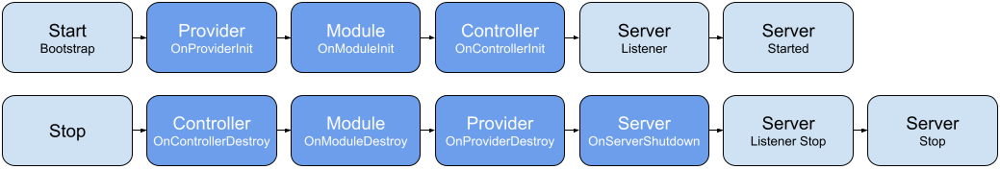

# Lifecycle
The framework give you access also to lifecycle events. They can be hooked via interfaces and/or via the Event Manager Service.

## Interface hooks
The interface hooks allows the developer to control the lifecycle synchronously where possible, hence, utilize `async/await` statements to wait for processes through stepping in the lifecycle.

## Event hooks
The lifecycle is also firing asynchronous events that can be consumed at developer will and in separate providers implementations.

## Start stage lifecycle

| What                 | Interface           | Interface type | Event                        |
|----------------------|---------------------|----------------|------------------------------|
| **Server bootstrap** | `OnServerBootstrap` | All            | `lifecycle.bootstrap`        |
| **Provider init**    | `OnProviderInit`    | Injectables    | `lifecycle.init.provider`    |
| **Module init**      | `OnModuleInit`      | Modules        | `lifecycle.init.module`      |
| **Controller init**  | `OnControllerInit`  | Controllers    | `lifecycle.init.controller`  | 
| **Server listening** | `OnServerListen`    | All            | `lifecycle.server.listening` |
| **Server started**   | `OnServerStarted`   | All            | `lifecycle.server.started`   |

## Stop stage lifecycle
The stop stage will refer to the `SIGINT`, `SIGTERM`, `SIGBREAK`, `SIGHUP` signals.
Please read the Node.js process signal event [documentation](https://nodejs.org/api/process.html#process_signal_events) to understand which of them are available in your OS.

| What                     | Interface              | Interface type | Event                             |
|--------------------------|------------------------|----------------|-----------------------------------|
| **Controller destroy**   | `OnControllerDestroy`  | Controllers    | `lifecycle.destroy.controller`    |
| **Module destroy**       | `OnModuleDestroy`      | Modules        | `lifecycle.destroy.module`        |
| **Provider destriy**     | `OnProviderDestroy`    | Injectables    | `lifecycle.destroy.provider`      |
| **Server listener stop** | `OnServerListenStop`   | All            | `lifecycle.server.listening.stop` | 
| **Server shutdown**      | `OnServerShutdown`     | All            | `lifecycle.server.shutdown`       |

## Error lifecycle

| What                     | Interface             | Interface type | Event                          |
|--------------------------|-----------------------|----------------|--------------------------------|
| **Controller destroy**   | `OnUncaughtException` | All            | `lifecycle.uncaught.exception` |
| **Module destroy**       | `OnUncaughtRejection` | All            | `lifecycle.uncaught.rejection` |
